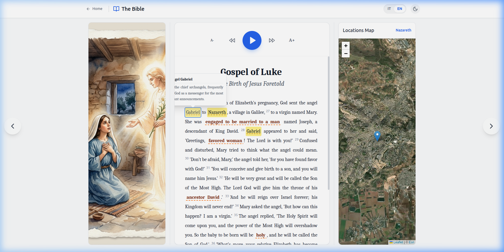
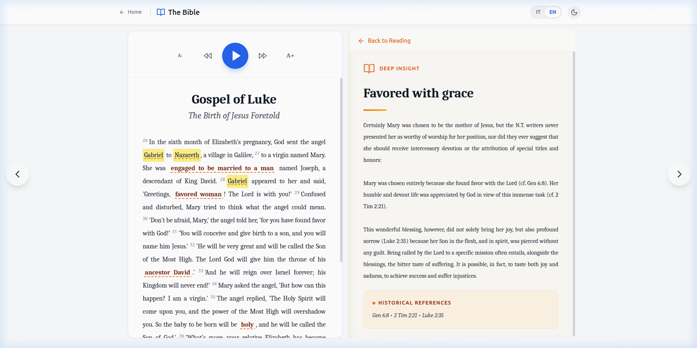

Raffaele Bagnato
raffaele.wet@gmail.com

# The Digital Bible – Interactive Experience

A modern, immersive, and interactive React web application designed to explore sacred texts through satellite maps, detailed illustrations, and advanced AI textual analysis.

## ✨ Features
- **Bilingual Interface (EN/IT):** Native support for the English New Living Translation (NLT) and Italian versions, with English as the primary default.
- **Deep Insights Panel:** Interactive in-text theological and historical references. Clicking on highlighted terms (orange dashed underline) dynamically expands the layout to a side-by-side view with extensive bilingual context.
- **AI Biblical Analyst:** High-end textual analysis using Gemini AI. Select any text segment to receive instant context on historical settings, theological meaning, and original Greek/Aramaic term analysis.
- **Biblical Illustrations:** Each chapter is accompanied by high-quality illustrations to provide visual immersion.
- **Satellite Map Navigation:** Integrated geographical tracking of biblical events using interactive satellite maps.
- **Native Text-to-Speech:** High-quality reading synchronized with the active language.

## 🖼️ Visual Overview

| Main Landing Page | Chapter View | Glossary Popup |
| :---: | :---: | :---: |
|  |  |  |

| AI Analysis Drawer | Deep Insight (50/50 View) |
| :---: | :---: |
|  |  |


## 📖 How to Use

### 1. Navigating and Reading
On the **Home Page**, click on a story card (e.g., "The Birth") to enter reading mode. Use the sidebar map to track locations or the top playback controls for text-to-speech.

### 2. Exploring Deep Insights
Inside a chapter, look for words with an **orange dashed underline**. 
- **Click the term**: The layout will shift from a 3-column view to a 2-column "Deep Insight" mode.
- **Read details**: The right panel will display a rich theological commentary, including historical and scriptural references.
- **Return**: Click the "Back to Reading" button to restore the original layout.

### 3. Using the Glossary
Words highlighted in **yellow** (like "Gabriel" or "Nazareth") contain quick definitions:
- **Click or Hover**: A popup will appear with a concise explanation of the person, place, or term.

### 4. Using the AI Biblical Analyst
For a personalized study of any verse or phrase:
1. **Select the Text**: Use your mouse to highlight any portion of the Bible text.
2. **Click the AI Icon**: A small action button will appear near your selection.
3. **Ask the Analyst**: A right-side drawer will open. You can ask specific questions like *"Who is Gabriel?"* or *"Analyze the Greek root of this word."*
4. **Review Analysis**: The AI provides a detailed breakdown including historical context and linguistic nuances.

## 🛠 Tech Stack
- **React** (UI Components & State Management)
- **Tailwind CSS** (Styling & Dark Mode)
- **Google Gemini API** (Theological AI Analysis)
- **Leaflet** (Interactive Satellite Maps)
- **Vite** (Build Tool)

## 🚀 Installation & Setup

1. **Clone the repository**:
   ```bash
   git clone https://github.com/raffaele-wet/The-Digital_Bible.git
   cd Progetto_Bibbia
   ```

2. **Install dependencies**:
   ```bash
   npm install
   ```

3. **Configure Environment**: 
   Create a `.env.local` file in the root and add your API key:
   ```env
   VITE_AI_API_KEY=your_gemini_api_key_here
   ```

4. **Start the development server**:
   ```bash
   npm run dev
   ```

## 🤝 Contributing
Contributions are welcome! This project uses a decoupled plugin architecture, making it easy to add new biblical chapters by updating the `src/content/` directory.

---
> [!NOTE]
> This project is designed for both academic study and personal spiritual exploration.
