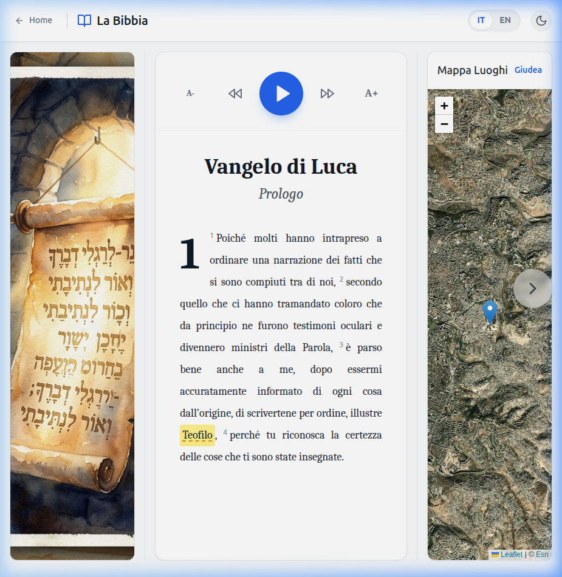
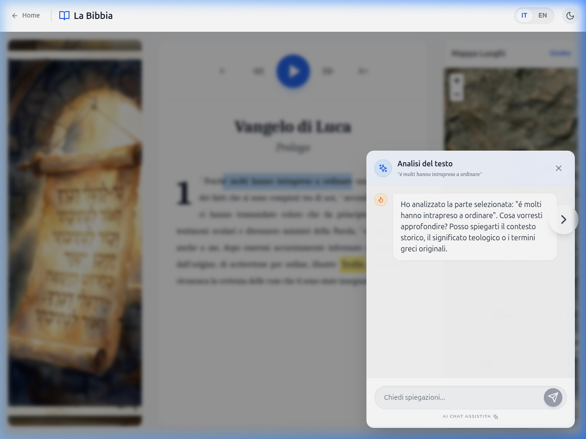

Raffaele Bagnato
raffaele.wet@gmail.com

# The Digital Bible – Interactive Experience

A modern, immersive, and interactive React web application designed to explore sacred texts through satellite maps, detailed illustrations, and advanced AI textual analysis.

## ✨ Features
- **Bilingual Interface (EN/IT):** Native support for the English New Living Translation (NLT) and Italian versions, with English as the primary default.
- **Deep Insights Panel:** Interactive in-text theological and historical references that dynamically transform the layout to show extensive bilingual context for key biblical verses.
- **AI Biblical Analyst:** High-end textual analysis using Gemini AI. Select any verse to receive context on historical settings, theological meaning, and original Greek/Aramaic terms.
- **Biblical Illustrations:** Each chapter is accompanied by high-quality illustrations to provide visual immersion.
- **Satellite Map Navigation:** Integrated geographical tracking of biblical events using interactive satellite maps.
- **Interactive Glossary:** Hover over highlighted keywords for instant theological insights.
- **Native Text-to-Speech:** High-quality reading synchronized with the active language.

## 🖼️ Visual Overview

| Home Page | Chapter View | AI Analysis |
| :---: | :---: | :---: |
|  |  |  |

### 🎥 Project Demo
[Watch the interactive demo](public/screenshots/demo.webp)

## 🛠 Tech Stack
- **React** (UI Components & State Management)
- **Tailwind CSS** (Styling & Dark Mode)
- **Google Gemini API** (Theological AI Analysis)
- **Leaflet** (Interactive Satellite Maps)
- **Vite** (Build Tool)

## 🚀 Installation & Setup

1. **Clone the repository**:
   ```bash
   git clone https://github.com/raffaele-wet/Progetto_Bibbia.git
   cd Progetto_Bibbia
   ```

2. **Install dependencies**:
   ```bash
   npm install
   ```

3. **Configure Environment**: 
   Create a `.env.local` file in the root and add your API key:
   ```env
   VITE_AI_API_KEY=your_gemini_api_key_here
   ```

4. **Start the development server**:
   ```bash
   npm run dev
   ```

## 🤝 Contributing
Contributions are welcome! This project uses a decoupled plugin architecture, making it easy to add new biblical chapters by updating the `src/content/` directory.

---
> [!NOTE]
> This project is designed for both academic study and personal spiritual exploration.
